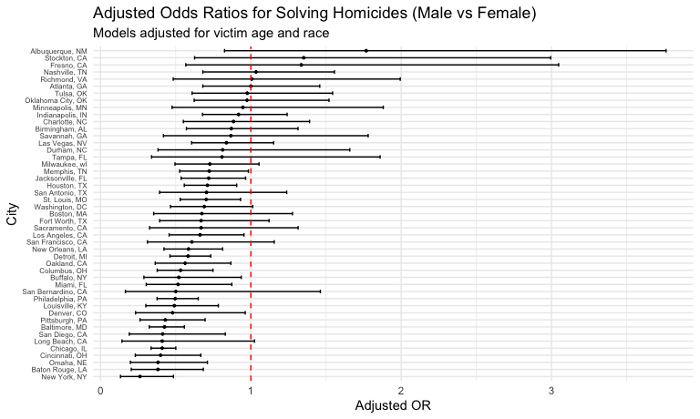
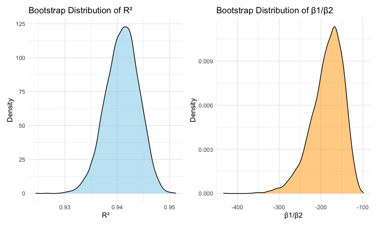

Homework6_zc2823
================
2025-11-16

# Problem 1

### Read & Cleaning Data

``` r
homi_df = read_csv("data/homicide-data.csv") |> 
  clean_names() |> 
  mutate(
    city_state = str_c(city, ", ", state),
    victim_age = as.numeric(victim_age),
    # solved = 1; unsolved = 0
    resolved = disposition == "Closed by arrest"
  ) |> 
  # omit the specific cities & Tulsa, AL
  filter(
    !(city_state %in% c("Dallas, TX", "Phoenix, AZ", "Kansas City, MO")),
    !(city == "Tulsa" & state == "AL"),
    victim_race %in% c("White", "Black"),
    !is.na(victim_age),
    !is.na(victim_sex),
    !is.na(resolved)
  ) |> 
  mutate(
    victim_race = fct_relevel(victim_race, "White"),   # Reference: White
    victim_sex  = fct_relevel(victim_sex, "Female")    # Reference: Female
  )
```

    ## Rows: 52179 Columns: 12
    ## ── Column specification ────────────────────────────────────────────────────────
    ## Delimiter: ","
    ## chr (9): uid, victim_last, victim_first, victim_race, victim_age, victim_sex...
    ## dbl (3): reported_date, lat, lon
    ## 
    ## ℹ Use `spec()` to retrieve the full column specification for this data.
    ## ℹ Specify the column types or set `show_col_types = FALSE` to quiet this message.

    ## Warning: There was 1 warning in `mutate()`.
    ## ℹ In argument: `victim_age = as.numeric(victim_age)`.
    ## Caused by warning:
    ## ! NAs introduced by coercion

### Logistic regression for Baltimore

``` r
## Baltimore subset 
baltimore_df =
  homi_df |> 
  filter(city_state == "Baltimore, MD")

## Fit logistic regression
baltimore_fit = glm(
  resolved ~ victim_age + victim_sex + victim_race,
  data   = baltimore_df,
  family = binomial()
)

## Extract adjusted OR comparing male vs female victims
baltimore_or =
  baltimore_fit |> 
  tidy(conf.int = TRUE, exponentiate = TRUE) |> 
  filter(term == "victim_sexMale") |> 
  select(term, estimate, conf.low, conf.high)

baltimore_or |> 
  knitr::kable(digits = 3)
```

| term           | estimate | conf.low | conf.high |
|:---------------|---------:|---------:|----------:|
| victim_sexMale |    0.426 |    0.324 |     0.558 |

### Run glm for all cities & extract ORs

``` r
city_or_results =
  homi_df |> 
  nest(data = -city_state) |> 
  mutate(
    models = map(
      data,
      \(df) glm(resolved ~ victim_age + victim_sex + victim_race,
                data = df, family = binomial())
    ),
    tidied = map(
      models,
      \(mod) tidy(mod, conf.int = TRUE, exponentiate = TRUE)
    )
  ) |> 
  select(city_state, tidied) |> 
  unnest(tidied) |> 
  filter(term == "victim_sexMale") |> 
  select(city_state, estimate, conf.low, conf.high) |> 
  mutate(
    city_state = fct_reorder(city_state, estimate)
  )
```

    ## Warning: There were 43 warnings in `mutate()`.
    ## The first warning was:
    ## ℹ In argument: `tidied = map(models, function(mod) tidy(mod, conf.int = TRUE,
    ##   exponentiate = TRUE))`.
    ## Caused by warning:
    ## ! glm.fit: fitted probabilities numerically 0 or 1 occurred
    ## ℹ Run `dplyr::last_dplyr_warnings()` to see the 42 remaining warnings.

### Plot ORs and CIs for all cities

``` r
city_or_results |> 
  ggplot(aes(x = city_state, y = estimate)) +
  geom_point(size = 0.7) +
  geom_errorbar(aes(ymin = conf.low, ymax = conf.high), width = 0.5) +
  geom_hline(yintercept = 1, linetype = "dashed", color = "red") +
  coord_flip() +
  labs(
    title = "Adjusted Odds Ratios for Solving Homicides (Male vs Female)",
    subtitle = "Models adjusted for victim age and race",
    x = "City",
    y = "Adjusted OR"
  ) +
  theme_minimal() +
  theme(axis.text.y = element_text(size = 6), lineheight = 0.9)
```

    ## Warning in plot_theme(plot): The `lineheight` theme element is not defined in
    ## the element hierarchy.



#### Comment

The plot shows substantial variation across cities in the adjusted odds
ratio (OR) for solving homicides involving male victims compared to
female victims, controlling for victim age and race.

A number of cities, such as Albuquerque, NM, Stockton, CA, and Fresno,
CA, have ORs well above 1, indicating that cases involving male victims
were more likely to be solved. However, the confidence intervals in
several of these cities are wide, suggesting considerable
uncertainty—likely due to smaller sample sizes or quasi-complete
separation in the logistic models.

In contrast, many large cities—including Baltimore, MD, Chicago, IL,
Cincinnati, OH, and New York, NY—have ORs close to or below 1, and most
of their confidence intervals cross the null value of 1. This implies no
strong evidence of a male–female difference in case resolution rates in
these jurisdictions after adjustment.

# Problem 2

### Load the data

``` r
data("weather_df")
weather_df = weather_df |> 
  drop_na(tmax, tmin, prcp)
```

### Define bootstrap function

``` r
boot_samples = 
  weather_df |> 
  modelr::bootstrap(n = 5000)
```

### Produce estimates of the two quantities

``` r
boot_results =
  boot_samples |> 
  mutate(
    models = map(strap, \(df) lm(tmax ~ tmin + prcp, data = df)),
    glance  = map(models, glance),
    tidyres = map(models, tidy)
  ) |> 
  mutate(
    r2 = map_dbl(glance, \(g) g$r.squared),

    beta_ratio = map_dbl(tidyres, \(t) {
      b1 = t$estimate[t$term == "tmin"]
      b2 = t$estimate[t$term == "prcp"]
      b1 / b2
    })
  ) |> 
  select(r2, beta_ratio)
```

### Hist/Density plot

#### r² distribution + β1 / β2 distribution

``` r
p_r2 =
  boot_results |> 
  ggplot(aes(x = r2)) +
  geom_density(fill = "skyblue", alpha = 0.5) +
  labs(
    title = "Bootstrap Distribution of R²",
    x = "R²",
    y = "Density"
  )

p_ratio =
  boot_results |> 
  ggplot(aes(x = beta_ratio)) +
  geom_density(fill = "orange", alpha = 0.5) +
  labs(
    title = "Bootstrap Distribution of β1/β2",
    x = "β1/β2",
    y = "Density"
  )

p_r2 + p_ratio 
```



The bootstrap distributions of the two statistics exhibit strikingly
different behaviors. The distribution of $R^2$ is extremely narrow and
highly concentrated around its observed value, indicating that the
strength of the linear relationship between $t_{\max}$ and the
predictors is very stable across bootstrap samples. In contrast, the
distribution of the ratio $\beta_1 / \beta_2$ is much wider and
substantially more variable. This occurs because precipitation (the
coefficient $\beta_2$) has a much weaker and less stable association
with maximum temperature, making the ratio $\beta_1 / \beta_2$ highly
sensitive and unstable.

Although the vertical scales of the two density plots differ due to
probability density normalization, placing the distributions
side-by-side is still informative. The comparison clearly shows that
$R^2$ is a highly stable estimator, whereas the ratio
$\beta_1 / \beta_2$ exhibits substantial uncertainty. The combined
visualization therefore effectively highlights the relative variability
of the two bootstrap estimators.

### 95% CI

``` r
r2_ci =
  boot_results |> 
  summarize(
    low  = quantile(r2, 0.025),
    high = quantile(r2, 0.975)
  )

ratio_ci =
  boot_results |> 
  summarize(
    low  = quantile(beta_ratio, 0.025),
    high = quantile(beta_ratio, 0.975)
  )
```

Using the 5000 bootstrap samples, the 95% confidence interval for $R^2$
is  
**0.934** to **0.947**.

For the ratio $\beta_1 / \beta_2$, the 95% bootstrap interval is  
**-274.795** to **-125.484**.

# Problem 3
